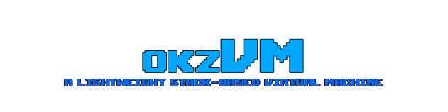

<div align="center">
  <p>
    
  </p>

  <h4>A lightweight stack-based virtual machine with a Lua-inspired scripting language. Pixel graphics, a software 3D rasterizer, audio, file I/O, and multitasking. Developers write their own parsers and tools — the VM provides what it has to.</h4>
</div>

## What it is

okzVM is not a game engine. It's a runtime. You get a screen, a keyboard, a mouse, a file system, an audio engine, and a scheduler. Everything else — sprite loading, font rendering, model parsing — that's on you.

The language looks like Lua. It compiles to bytecode. It runs in a sandboxed process with its own memory, stack, and instruction counter. Multiple processes can run at the same time, sharing CPU time through a round-robin scheduler.

## Why it exists

Most Lua-embedding projects bury you in APIs. okzVM goes the other direction. The VM gives you the primitives. You build the rest. That means you actually understand what your code is doing, and you're not fighting someone else's abstraction layer when it breaks.

The 3D software rasterizer is there because it's fun to watch pixels get drawn on a CPU. It's not fast. It's not supposed to be. It's supposed to be something you can read, modify, and learn from.

## Getting started

### Requirements

- Node.js 18+
- npm

### Run

```bash
git clone https://github.com/okz-spec/okzVM.git
cd okzVM
npm install
npm run dev
```

The Electron window opens. Go to File > Open Project and point it at one of the examples.

### Build

```bash
npm run build
npm start
```

## Language

See [LANGUAGE.md](../docs/LANGUAGE.md) for the full language reference and API documentation.

## Examples

Check the `examples/` directory in the repository for sample projects demonstrating the VM's capabilities

## Libraries

Optional helper libraries live in [libraries/](../libraries/). They're not required — you can build everything from scratch with the native API. They just save you time on common patterns like 3D scene construction.

See [libraries/README.md](../libraries/README.md) for documentation.

Copy it into your project's `lib/` folder:

```
my-project/
├── main.okz
└── lib/
    └── scene3d.okzlib
```

Import by name:

```lua
import scene3d

local scene = SCENE3D.merge({
  SCENE3D.floor(20, 2, 80, 100, 60),
  SCENE3D.box(0, 0.5, 0, 1, 1, 1, 200, 100, 50),
})
```

## Tools

### VS Code Extension

`tools/vscode-okz/` — Syntax highlighting and snippets for okzVM files. See [tools/vscode-okz/README.md](../tools/vscode-okz/README.md).

## Project structure

```
okzVM/
├── src/
│   ├── compiler/       # Lexer, parser, bytecode generator
│   ├── vm/             # Runtime: process, scheduler, renderer, audio
│   ├── renderer/       # React UI (Electron)
│   ├── main/           # Electron main process
│   └── preload/        # IPC bridge
├── examples/           # Sample projects
├── libraries/          # Shared okzVM libraries
├── tools/              # Browser-based tools
└── docs/               # Language reference
```

## Contributing

See [CONTRIBUTING.md](CONTRIBUTING.md).

## License

See [LICENSE](../LICENSE).